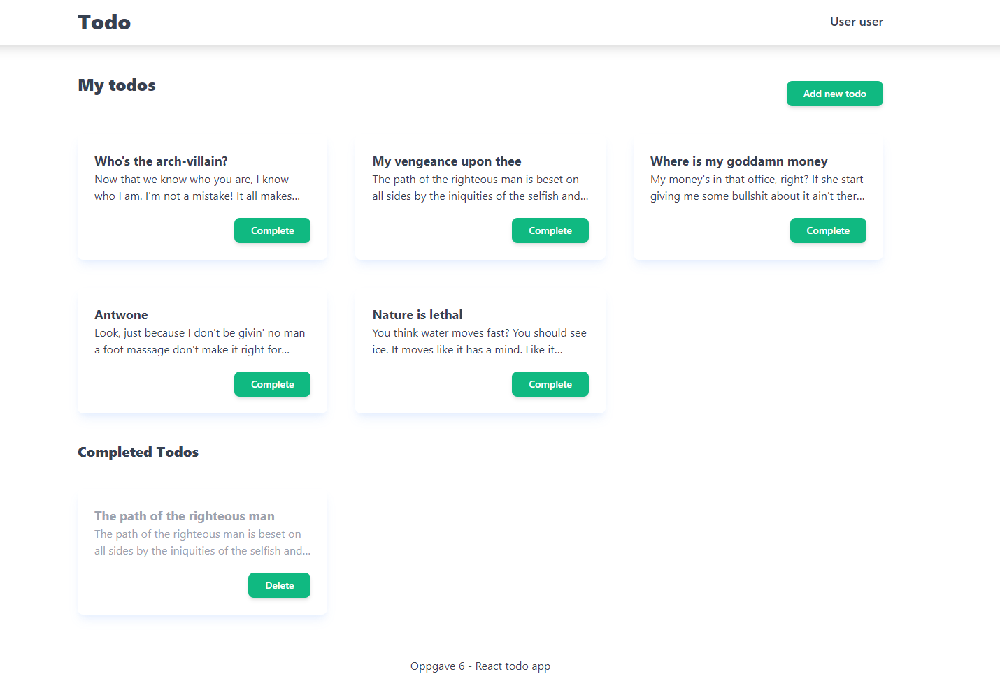
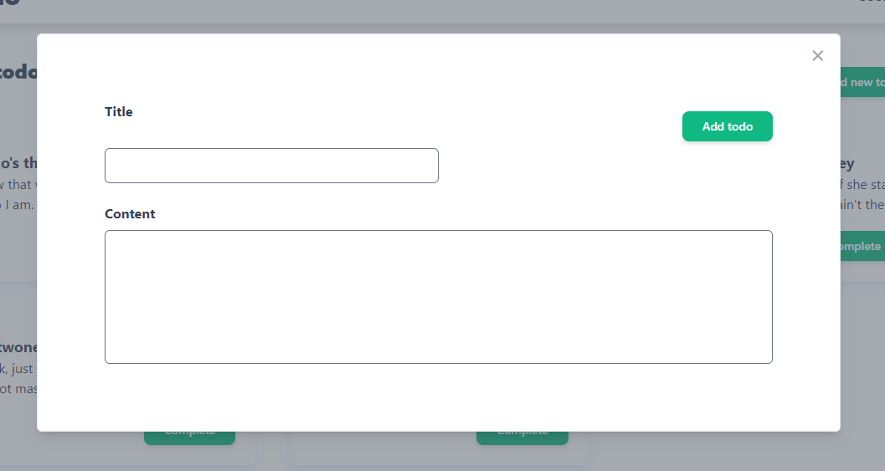
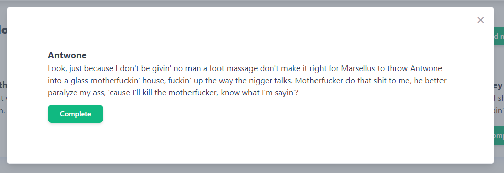

# React Todo Application

I denne oppgaven skal vi lage en todo applikasjon i react. Den skal lages etter følgende skisse: [todo applikasjon skisse](https://xd.adobe.com/view/44521979-0f5f-44d1-9de1-5c400cad0d0e-1101/)

## Min applikasjon

Siden lister opp alle todo'er som ligger listen for ikke- eller ferdig todos. Det er kun ett kort utdrag av innholdet som vises. Ved å trykke på todo-kortet kan man se hele innholdet. Ved å trykke på `complete` flyttes todo-elementet inn i listen _completed todos_. Trykkes det på `delete` fjernes den fra denne listen og applikasjonen helt.

### Legg til todo

Når `Add new todo` trykkes på vil en modal med inout-felter dukke opp, og man kan legge til en ny todo.

### Lese hele todoen

For å lese hele innholde i en todo, trykker man på todo-kortet og en modal dukker opp med hele innholdet.
